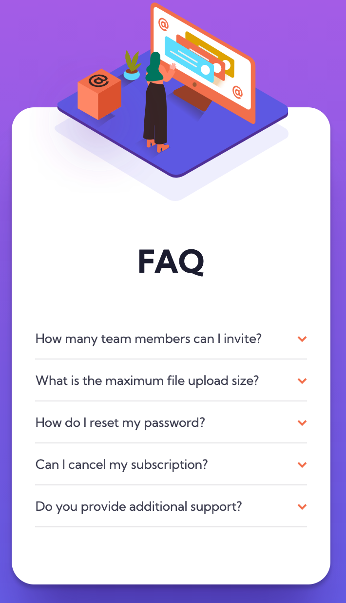
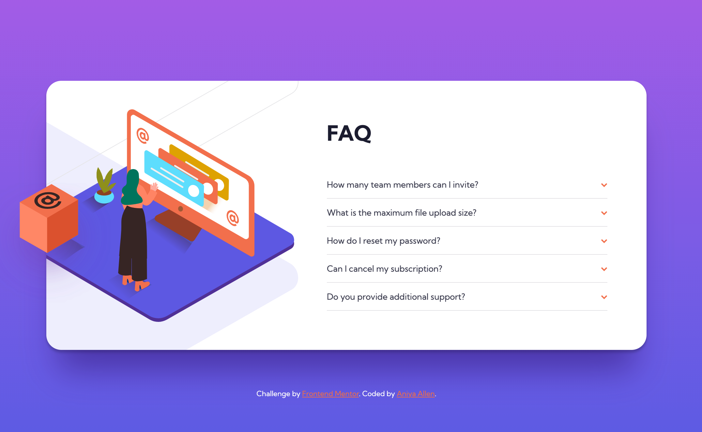

# Frontend Mentor - FAQ accordion card

## Welcome! 👋

This is a solution to the [FAQ accordion card challenge on Frontend Mentor](https://www.frontendmentor.io/challenges/faq-accordion-card-XlyjD0Oam).

## Table of contents

- [Overview](#overview)
  - [The challenge](#the-challenge)
  - [Screenshot](#screenshot)
  - [Links](#links)
- [My process](#my-process)
  - [Built with](#built-with)
  - [What I learned](#what-i-learned)
- [Author](#author)

## Overview

## The challenge

The challenge was to build out a FAQ accordion card and get it looking as close to the provided design as possible.

Users should be able to:

- View the optimal layout for the component depending on their device's screen size
- See hover states for all interactive elements on the page
- Hide/Show the answer to a question when the question is clicked

### Screenshot

| Mobile (375px)                                 | Desktop (1440px)                                 |
| ---------------------------------------------- | ------------------------------------------------ |
|  |  |

### Links

- Solution URL: [Code](https://github.com/amallen1/faq-card)
- Live Site URL: [FAQ Accordion Card](https://objective-beaver-407c95.netlify.app/)

## My Process

### Built with

- HTML
- Scss
- Javascript
- Mobile-first workflow

## What I learned

This challenged helped to increase my skills at positioning items with CSS.

## Author

- Frontend Mentor - [@amallen1](https://www.frontendmentor.io/profile/amallen1)
